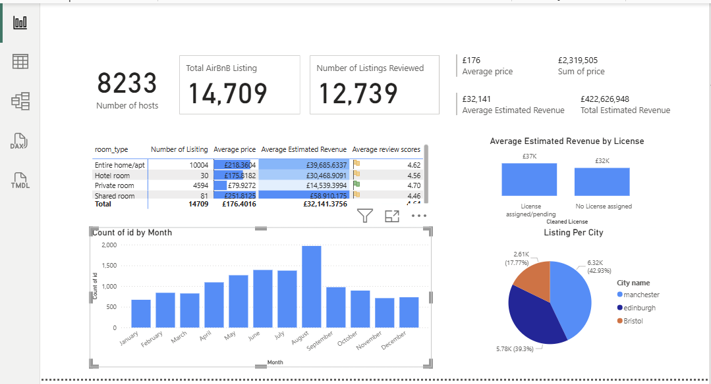

# 📊 Airbnb UK Market Reporting Dashboard  
**Power BI | Power Query | DAX**

---

## 📌 Project Overview

This project delivers an investor-focused reporting dashboard analyzing short-term rental market size, listing dynamics, and revenue potential across three UK cities:

- Edinburgh  
- Bristol  
- Manchester  

The objective is to provide data-driven insights for potential Airbnb investors to evaluate:

- Market saturation  
- Listing composition  
- Revenue potential  
- Host commercial activity  
- Occupancy proxies  

---

## 🎯 Business Objectives

### Objective 1: Understand Market Size & Listing Dynamics

Assess market saturation, competition intensity, and listing structure across cities.

**Key Questions Addressed:**

- How many active listings exist per city?
- What is the breakdown by room type (Entire Home, Private Room, Shared Room)?
- How many nights per year are listings typically available?
- What proportion of hosts operate multiple listings (commercial vs casual hosts)?

---

### Objective 2: Evaluate Occupancy Trends & Revenue Potential

Identify income opportunities and high-demand listing segments.

**Key Questions Addressed:**

- What is the average reviews per month by city and room type?
- Which neighbourhoods show highest review frequency (occupancy proxy)?
- What is the relationship between price and reviews/month?
- What is the estimated average income per city?

---

## 🛠 Data Preparation (Power Query)

- Added a **City identifier column** to all listing and review files
- Appended datasets into consolidated tables:
  - `AirBnB UK LISTING`
  - `AirBnB UK REVIEW`
- Standardized pricing, availability, and review fields
- Ensured proper data types across all columns
- Created a **Grouped License column** using conditional logic:
  - `License Assigned` → if license contains "EH" or "10"
  - `No License` → otherwise

---

## 📊 Data Model & Relationships

- Built a dedicated **Date Table**
- Established relationships:
  - Date → Review table
  - Listing → Review table
- Created DAX calculated column:

- Developed measures for:
  - Total Listings
  - Unique Hosts
  - Average Price
  - Total Revenue
  - Average Estimated Revenue

---

## 📈 Dashboard Structure

### 🟦 Page 1 — Summary View

Interactive slicers:
- City
- Grouped License
- Room Type

**Visuals Included:**

- KPI Cards:
  - Total Listings
  - Unique Hosts
  - Average Price
  - Total Estimated Revenue
- Room Type performance table (price, revenue, review score)
- Bar chart: Average Revenue by License Group
- Pie chart: Listing Distribution by City
- Map: Geographic distribution of listings
- Line chart: Monthly listing trend (2023–2024)

---

### 🟨 Page 2 — Advanced Analysis (Freestyle Insights)

Expanded analysis based on findings from Page 1:

- Revenue variation by room type
- High-demand neighbourhood identification
- Price vs Reviews per Month scatter analysis
- Host commercial activity comparison
- Additional exploratory breakdowns

Optional enhancement included:
- Drill-through / tooltip functionality for deeper interaction

---

## 🔍 Key Insights Enabled

- Clear comparison of listing concentration across cities
- Identification of high-revenue room types
- Revenue differences between licensed and unlicensed listings
- Detection of seasonal listing activity trends
- Commercial host participation levels

---

## 📁 Repository Structure

---

## 🛠 Tools & Technologies

- Power BI Desktop
- Power Query (ETL & Data Transformation)
- DAX (Calculated Columns & Measures)
- Data Modeling & Relationships
- Interactive Dashboard Design

---

## 💡 Investor Value

This dashboard enables investors to:

- Identify cities with stronger revenue potential
- Detect oversaturated markets
- Compare commercial vs casual hosting activity
- Assess demand proxies through review frequency
- Make data-informed property investment decisions

---

## 🚀 Future Enhancements

- Add predictive occupancy modeling
- Incorporate geographic clustering
- Integrate seasonal pricing elasticity analysis
- Expand to additional UK cities

---

---

## 🖼 Dashboard Preview

### 📊 Summary View

**What this page shows:**

- KPI cards:
  - Total Listings (14,709)
  - Unique Hosts (8,233)
  - Listings Reviewed (12,739)
  - Average Price (£176)
  - Total Estimated Revenue (£422M+)
- Room type performance comparison
- Average estimated revenue by license group
- Listing distribution by city (Manchester, Edinburgh, Bristol)
- Monthly listing activity trend

This page provides investors with a high-level market overview and revenue potential snapshot across cities.

---

